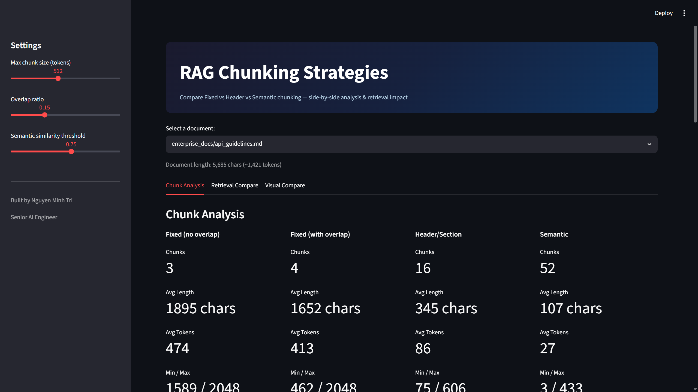
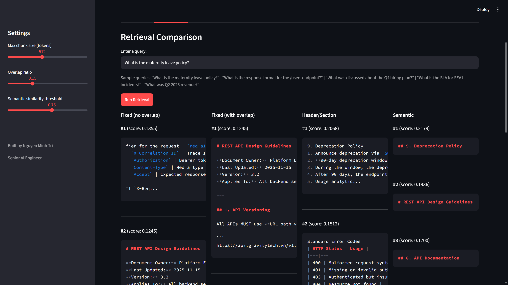
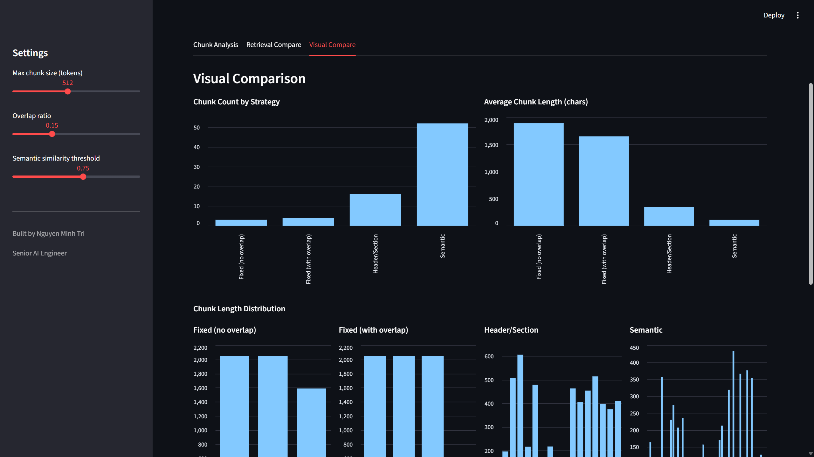

# RAG Chunking Strategies

Interactive comparison of 3 chunking strategies for RAG systems — see how document splitting impacts retrieval quality.

## Screenshots

### Chunk Analysis — Side-by-Side Metrics



### Retrieval Compare — Same Query, Different Results



### Visual Compare — Charts & Distribution



## Why This Matters

Chunking is the most underestimated step in RAG pipelines. Fixed-size chunking (every 512 tokens) is the default in most tutorials, but it breaks tables, splits code blocks mid-function, and loses section context. This project demonstrates the problem and compares alternatives.

## 3 Strategies Compared

| Strategy | How It Works | Best For |
|----------|-------------|----------|
| **Fixed-Size** | Cut every N characters, optional overlap | Baseline — fast, simple, but context-blind |
| **Header/Section** | Split on markdown headings, prepend heading to each chunk | Structured docs (policies, manuals, API refs) |
| **Semantic** | Group consecutive paragraphs by cosine similarity | Unstructured text (meeting notes, emails) |

## Quick Start

```bash
git clone https://github.com/Boothill2001/rag-chunking-strategies.git
cd rag-chunking-strategies
pip install -r requirements.txt
streamlit run app.py
```

## Dashboard Features

### Tab 1: Chunk Analysis
- Side-by-side metrics for all strategies: chunk count, avg length, boundary quality
- Expandable sample chunks to visually inspect split points

### Tab 2: Retrieval Compare
- Enter a query, see top-5 results from each strategy side-by-side
- Same query, same document, different chunking — different results

### Tab 3: Visual Compare
- Bar charts: chunk count and average length per strategy
- Length distribution histograms
- Boundary quality comparison

## Test Documents

- **18 enterprise docs** — HR policies, finance reports, engineering guides, legal templates
- **3 complex docs** designed to expose chunking edge cases:
  - `api_reference.md` — Code blocks + nested headers + tables (fixed chunking breaks code blocks)
  - `financial_report.md` — Dense tables with numbers (fixed chunking loses table headers)
  - `meeting_notes.md` — No headings, topic shifts mid-paragraph (header chunking falls back, semantic shines)

## Key Takeaways

> **Fixed chunking** produces uniform chunks but cuts through sentences, tables, and code blocks. Retrieval scores are lower because chunks lack coherent context.
>
> **Header chunking** preserves document structure — each chunk maps to a logical section. Best retrieval quality on structured docs. The trade-off is high variance in chunk size.
>
> **Semantic chunking** groups related paragraphs by embedding similarity. Best for unstructured text where headings don't exist. The trade-off is compute cost (must embed every paragraph upfront).

## Tech Stack

- **Embedding:** all-MiniLM-L6-v2 (384-dim)
- **Vector DB:** Qdrant (in-memory, no Docker needed)
- **UI:** Streamlit
- No LLM API required — pure retrieval comparison

## Related Projects

Part of a GenAI portfolio:

1. **[Advanced RAG](https://github.com/Boothill2001/RAG_project)** — Hybrid search + re-ranking
2. **[Research Copilot](https://github.com/Boothill2001/AI_AGENT_LANGGHAPH)** — LangGraph agent + MCP
3. **[Enterprise RAG Assistant](https://github.com/Boothill2001/Enterprise_RAG_Assistant)** — RBAC, tool calling, eval harness
4. **Chunking Strategies** (this repo) — Chunking impact on retrieval quality

## Author

**Nguyen Minh Tri** — Senior AI Engineer

- Email: minhtri.cm2001@gmail.com
- [GitHub](https://github.com/Boothill2001)
